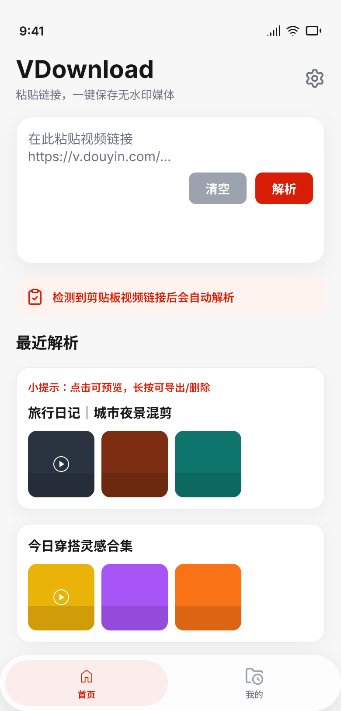
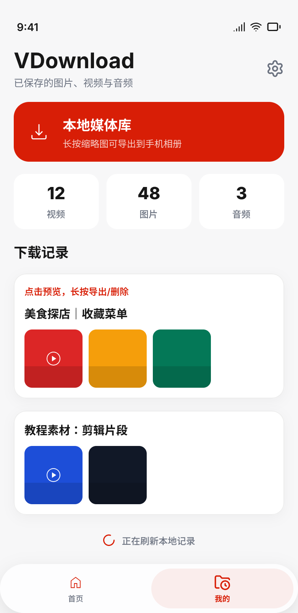
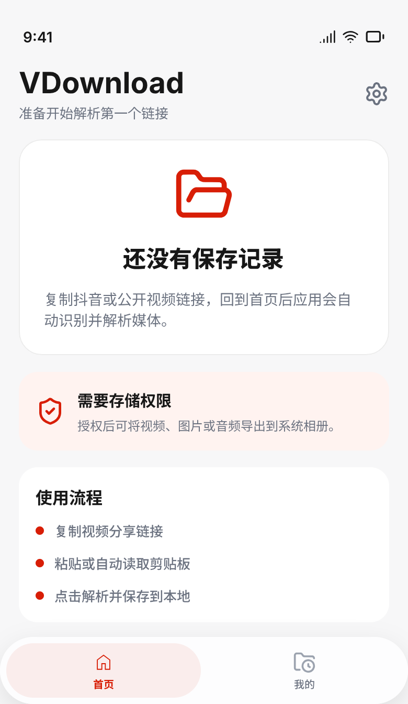

# VDownload

VDownload 是一个用于解析和下载抖音或公开视频链接的 Android 应用。它会自动读取剪贴板，识别媒体链接，并把图片、视频或音频保存到本地，方便后续预览和导出。

## 功能

- 自动读取剪贴板中的链接
- 解析并下载视频、图片和音频
- 本地保存下载记录，支持删除和预览
- 设置页可控制存储权限和首页自动解析开关
- 支持将已下载媒体导出到系统相册

## 下载

[下载 APK](app/release/app-release.apk)

安装包路径：`app/release/app-release.apk`

## 设计截图

首页解析页

下载记录页

设置页

